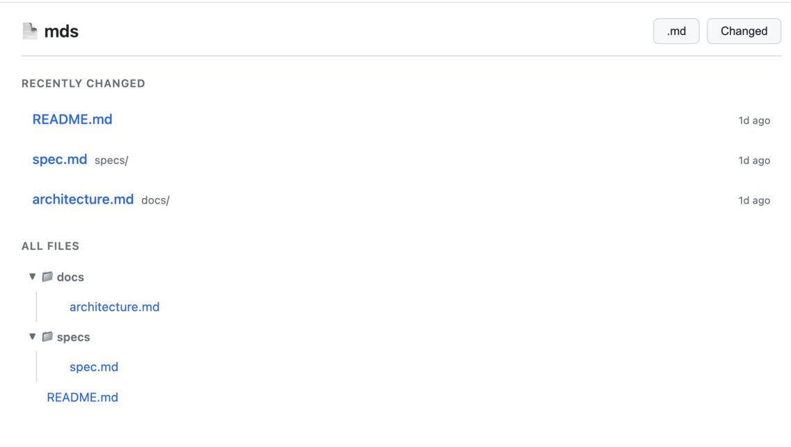
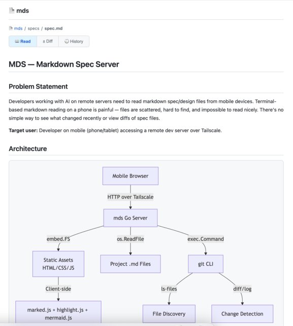
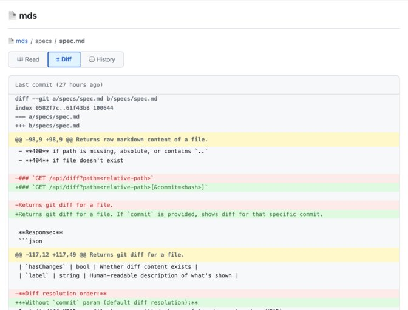

# MDS — Markdown Spec Server

A single-binary markdown viewer for browsing project specs from your phone.

## Problem

You develop with AI on a remote server. Specs, design docs, and SKILL files are scattered across directories. When you check from your phone:

- **Can't find anything** — which file changed? where's the latest spec?
- **Can't read anything** — raw markdown in a terminal on a 6-inch screen
- **Can't see diagrams** — Mermaid blocks are just text
- **Can't see what changed** — no quick way to view diffs

MDS fixes this. One command, instant web UI.

## Features

- 📄 Browse all files in a project (`.md` default, toggle to show all)
- 🔍 Recently changed files first, with **M** badge for uncommitted changes
- 🎨 Mermaid diagrams rendered, code syntax highlighted
- ± Git diff view — uncommitted changes or per-commit history
- 📱 Mobile-first responsive design
- 🌓 Dark/light mode (follows system)
- 🔌 Auto port shifting — run multiple instances, one per project

##### File list


##### Viewer


##### Diff View



## Usage

```bash
# Serve current directory
mds

# Serve a specific project
mds /path/to/project
```

Opens your browser automatically. Access from mobile via Tailscale.

## Install

```bash
go build -o mds .
cp mds ~/bin/  # or anywhere in your PATH
```

## License

MIT
