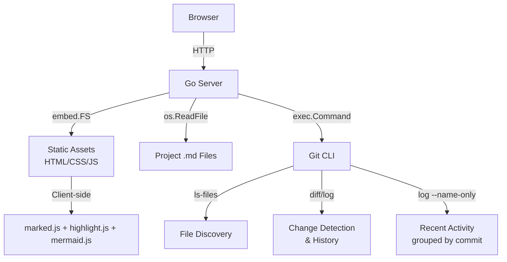

# Architecture

## Overview

MDS is a single-binary markdown spec viewer. Go server with embedded static assets, client-side rendering.



## Components

### HTTP Server (`main.go`)
- Serves static assets (embedded in binary via `//go:embed`)
- JSON API endpoints for file listing, content, diff, history, related files, recent activity
- Auto port shifting (8090–8110)
- Zero external dependencies at runtime

### Frontend SPA (`static/`)
- Hash-based routing (`#/` file list, `#/view/<path>` viewer)
- Client-side markdown rendering with marked.js
- Mermaid diagram rendering
- Syntax highlighting with highlight.js
- Responsive: mobile-first with two-column layout on wide screens

## API Endpoints

| Endpoint | Purpose |
|----------|---------|
| `GET /api/files` | List all .md files, sorted by mod time |
| `GET /api/content?path=` | Raw file content |
| `GET /api/diff?path=[&commit=]` | Git diff (uncommitted or per-commit) |
| `GET /api/history?path=` | Commit history for a file (up to 50) |
| `GET /api/related?path=` | Related files by link/similarity/proximity |
| `GET /api/recent` | Recent changes grouped by git commit |
| `GET /api/asset?path=` | Serve project image files (jpg, png, gif, webp, svg, etc.) |

## Data Flow

### File List Page
| Step | Component | Action |
|------|-----------|--------|
| 1 | Browser | Request `/api/recent` |
| 2 | Server | Query git log for recent commits + uncommitted changes |
| 3 | Server | Return grouped results (uncommitted → commit groups) |
| 4 | Browser | Render commit-grouped activity feed + file tree |

### Viewer Page
| Step | Component | Action |
|------|-----------|--------|
| 1 | Browser | Request `/api/content?path=` |
| 2 | Server | Read file, return raw text |
| 3 | Browser | Render markdown (marked.js + highlight.js + mermaid) |
| 4 | Browser | (async) Request `/api/related?path=` for sidebar |
| 5 | Server | Score all .md files by links, heading similarity, directory proximity |
| 6 | Browser | Populate sidebar with grouped results |

## Related Files Algorithm

Three-signal weighted scoring (no ML, no external dependencies):

```
score = 0.45 × cross_references + 0.30 × heading_similarity + 0.25 × directory_proximity
```

| Signal | Weight | Method |
|--------|--------|--------|
| Cross-references | 0.45 | Parse `[text](path)` links, bidirectional |
| Heading similarity | 0.30 | Jaccard on H1–H3 tokens + filename tokens |
| Directory proximity | 0.25 | Same dir=1.0, parent/child=0.6, sibling=0.4 |

Returns top 8 results, grouped by signal type (linked, similar, nearby).

## Key Design Decisions

1. **Client-side rendering** — server sends raw markdown, browser renders
2. **No file watching / no caching** — scan on every request, fast enough (<10ms)
3. **`git ls-files` for discovery** — leverages git's `.gitignore` machinery
4. **Non-blocking sidebar** — related files fetched async, never blocks content rendering
5. **Embedded assets** — single binary deployment, no npm/asset directories

> **Note:** All rendering happens client-side for maximum performance.
