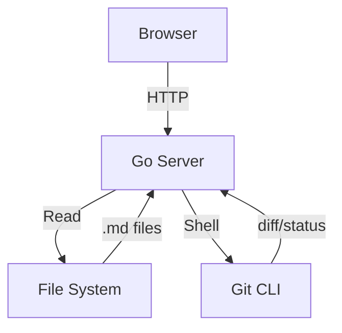

# Architecture

## Overview

The MDS server is a lightweight markdown spec viewer.



## Components

### HTTP Server
- Serves static assets (embedded in binary)
- JSON API for file listing and content
- Auto port shifting

### Frontend SPA
- Client-side markdown rendering
- Mermaid diagram support
- Syntax highlighting with highlight.js

```go
func main() {
    fmt.Println("Hello from MDS")
}
```

## Data Flow

| Step | Component | Action |
|------|-----------|--------|
| 1 | Browser | Request file list |
| 2 | Server | Scan project dir |
| 3 | Server | Return JSON |
| 4 | Browser | Render tree + list |

> **Note:** All rendering happens client-side for maximum performance.
