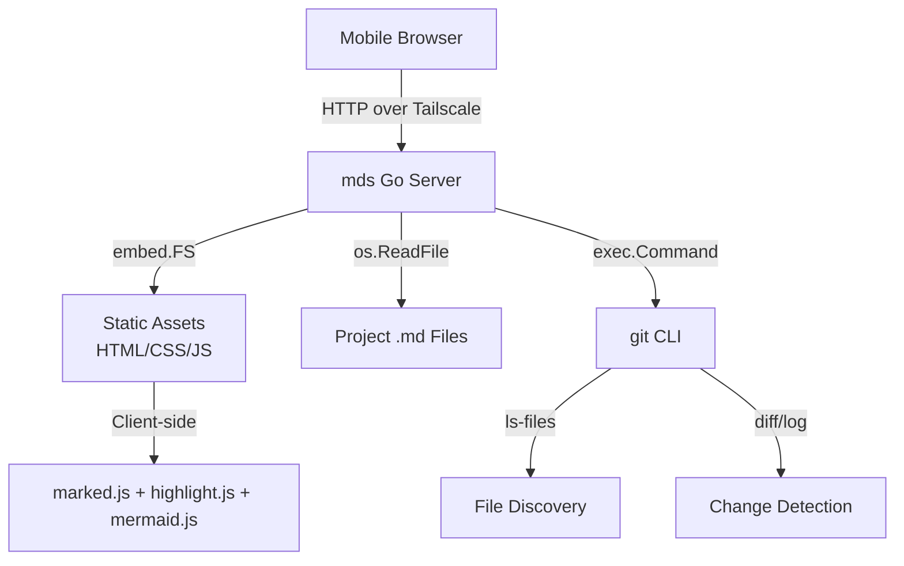

# MDS — Markdown Spec Server

## Problem Statement

Developers working with AI on remote servers need to read markdown spec/design files from mobile devices. Terminal-based markdown reading on a phone is painful — files are scattered, hard to find, and impossible to read nicely. There's no simple way to see what changed recently or view diffs of spec files.

**Target user:** Developer on mobile (phone/tablet) accessing a remote dev server over Tailscale.

## Architecture



**Single Go binary** with all assets embedded via `//go:embed`. Zero external dependencies at runtime. Client-side rendering — server sends raw markdown, browser renders it.

### Project Structure

```
mds/
├── main.go                    # Go server (all backend logic)
├── go.mod                     # Go module
├── static/
│   ├── index.html             # SPA shell
│   ├── app.js                 # Frontend logic (routing, rendering, UI)
│   ├── style.css              # Mobile-first responsive styles
│   └── vendor/                # Vendored JS/CSS (embedded in binary)
│       ├── marked.min.js      # Markdown parser
│       ├── highlight.min.js   # Syntax highlighting
│       ├── highlight-light.min.css
│       ├── highlight-dark.min.css
│       ├── hljs-{lang}.min.js # Language grammars (go, yaml, json, typescript,
│       │                      #   javascript, python, bash, sql, dockerfile, protobuf)
│       └── mermaid.min.js     # Diagram rendering
└── specs/
    └── spec.md                # This file
```

## Usage

```bash
# Serve current directory
mds

# Serve a specific project
mds /path/to/project
```

- Project name is derived from the directory name (e.g., `/home/user/myapp` → "myapp")
- Listens on `0.0.0.0` (accessible over Tailscale)
- Prints bound address to stdout on startup

## API Specification

### `GET /api/files`

Returns all `.md` files in the project directory, sorted by modification time (newest first).

**Response:**
```json
{
  "project": "myapp",
  "isGit": true,
  "files": [
    {
      "path": "docs/architecture.md",
      "name": "architecture.md",
      "dir": "docs",
      "modTime": 1710000000000,
      "changed": true
    }
  ]
}
```

| Field | Type | Description |
|-------|------|-------------|
| `project` | string | Directory base name |
| `isGit` | bool | Whether project is in a git repo |
| `files[].path` | string | Relative path from project root |
| `files[].name` | string | File basename |
| `files[].dir` | string | Parent directory (`.` for root) |
| `files[].modTime` | int64 | Unix milliseconds of last modification |
| `files[].changed` | bool | Has uncommitted git changes |

### `GET /api/content?path=<relative-path>`

Returns raw markdown content of a file.

- **Response:** `text/plain; charset=utf-8`
- **400** if path is missing, absolute, or contains `..`
- **404** if file doesn't exist

### `GET /api/diff?path=<relative-path>[&commit=<hash>]`

Returns git diff for a file. If `commit` is provided, shows diff for that specific commit.

**Response:**
```json
{
  "diff": "unified diff text...",
  "hasChanges": true,
  "label": "Uncommitted changes"
}
```

| Field | Type | Description |
|-------|------|-------------|
| `diff` | string | Unified diff text (empty if no changes) |
| `hasChanges` | bool | Whether diff content exists |
| `label` | string | Human-readable description of what's shown |

**Without `commit` param (default diff resolution):**
1. `git diff HEAD -- <file>` → uncommitted changes (staged + unstaged vs HEAD)
2. If empty: `git log -1` to find last commit that touched the file, then `git diff <commit>~1 <commit> -- <file>`
3. If first commit: synthesize a diff showing entire file as additions
4. If not a git repo: `label: "Not a git repository"`

**With `commit` param:**
1. Validate commit hash (hex characters only)
2. `git diff <commit>~1 <commit> -- <file>` → diff for that specific commit
3. If first commit: synthesize full-file addition diff
4. Label includes commit message and relative age (e.g., `"add license section (2 hours ago)"`)

### `GET /api/history?path=<relative-path>`

Returns git commit history for a file (up to 50 commits, follows renames).

**Response:**
```json
{
  "commits": [
    {
      "hash": "729a54c31e66...",
      "shortHash": "729a54c",
      "message": "add copyright year",
      "author": "pkomsit",
      "date": 1710000000000,
      "age": "2 hours ago"
    }
  ]
}
```

| Field | Type | Description |
|-------|------|-------------|
| `commits[].hash` | string | Full commit SHA |
| `commits[].shortHash` | string | Abbreviated commit SHA |
| `commits[].message` | string | Commit subject line |
| `commits[].author` | string | Author name |
| `commits[].date` | int64 | Unix milliseconds of commit date |
| `commits[].age` | string | Human-readable relative time |

Uses `git log --follow` to track file renames. NUL-delimited format for safe parsing.

## File Discovery

### Git repo (preferred)
1. `git ls-files --full-name '*.md' '**/*.md'` — tracked `.md` files
2. `git ls-files --others --exclude-standard '*.md' '**/*.md'` — untracked but not ignored
3. Merge both lists, deduplicate

This automatically respects `.gitignore` rules.

### Non-git fallback
- `filepath.WalkDir` recursive scan
- Skip directories: `node_modules`, `vendor`, `.git`, `__pycache__`
- Match `*.md` (case-insensitive)

### Change detection (git only)
- `git diff --name-only HEAD` — staged + unstaged changes vs HEAD
- `git diff --name-only --cached` — staged changes
- `git ls-files --others --exclude-standard` — untracked `.md` files
- All paths converted from git-root-relative to project-dir-relative

**No file watching or caching.** Full scan on every `/api/files` request. Fast enough for typical projects (milliseconds).

## Frontend (SPA)

### Routing

Hash-based routing, no server-side routing needed:

| Hash | Page |
|------|------|
| `#/` | File list |
| `#/view/<encoded-path>` | View a file |

### File List Page (`#/`)

Two sections:

1. **Recently Changed** — flat list of up to 20 files sorted by `modTime` descending
   - Shows: file name, parent directory, **M** badge if changed, relative time ("2m ago")
   - On mobile (<600px): directory path hidden to save space

2. **All Files** — collapsible directory tree
   - Directories sorted before files, both alphabetical
   - Folders collapsible with ▶ arrow toggle
   - **M** badge on changed files

**Filter toggle** (only shown when `isGit` is true):
- "Changed only" button in header toolbar
- When active: both sections filter to only `changed: true` files
- Button shows `✓ Changed only` with active styling when enabled

### View Page (`#/view/<path>`)

**Header:** Project name linking back to `#/`

**Breadcrumb:** `📄 project / dir / **filename.md**` — project links back to file list

**Mode toggle toolbar:**
- `📖 Read` — rendered markdown (default)
- `± Diff` — colorized unified diff
- `🕘 History` — commit history list

#### Read Mode
- Markdown rendered client-side with `marked.js` (GFM enabled)
- Code blocks: syntax highlighted with `highlight.js`
  - Language detection via ` ```lang ` fence
  - Fallback: auto-detect for unfenced blocks
- Mermaid blocks (` ```mermaid `): rendered as SVG diagrams
  - Wrapped in scrollable/zoomable container (`.mermaid-container`)
  - `max-height: 80vh` with overflow scroll
  - Theme follows system dark/light preference
- Tables, blockquotes, images, links all styled

#### Diff Mode
- Fetches from `/api/diff?path=...`
- Shows label at top (e.g., "Uncommitted changes", "Last commit (2 hours ago)")
- Colorized unified diff:
  - `+` lines: green background
  - `-` lines: red background
  - `@@` hunk headers: yellow background
  - `diff`, `index`, `---`, `+++` metadata: muted bold
- If no changes: centered "No changes" message
- Monospace font, `pre-wrap` with `break-all` for mobile

#### History Mode
- Fetches from `/api/history?path=...`
- Shows list of commits that touched this file (up to 50, follows renames)
- Each entry: short hash (styled as code badge), commit message, author, relative time
- Clicking a commit fetches `/api/diff?path=...&commit=<hash>` and shows colorized diff
- "← Back to history" button above diff to return to the commit list
- Commit list styled as bordered card list with hover states

## Styling

### Design System (CSS Custom Properties)

```
Light mode:
  --bg:              #ffffff     (page background)
  --bg-secondary:    #f6f8fa     (code blocks, cards)
  --bg-hover:        #f0f2f5     (hover state)
  --text:            #1f2328     (primary text)
  --text-secondary:  #656d76     (muted text)
  --border:          #d0d7de     (borders, dividers)
  --accent:          #0969da     (links, active states)
  --accent-bg:       #ddf4ff     (active button background)
  --green/green-bg:  #1a7f37 / #dafbe1  (diff additions)
  --red/red-bg:      #cf222e / #ffebe9  (diff deletions)
  --yellow-bg:       #fff8c5     (diff hunk headers)
  --badge-changed:   #da5a0b / #fff1e5  (M badge)

Dark mode (prefers-color-scheme: dark):
  --bg:              #0d1117
  --bg-secondary:    #161b22
  --text:            #e6edf3
  --accent:          #58a6ff
  ... (GitHub-dark-inspired palette)
```

### Typography
- System font stack: `-apple-system, BlinkMacSystemFont, "Segoe UI", Helvetica, Arial, sans-serif`
- Code font: `"SF Mono", "Fira Code", "Fira Mono", Menlo, Consolas, monospace`
- Base font size: `15px` (desktop), `14px` (mobile <600px)
- Line height: `1.6` (body), `1.7` (markdown content), `1.5` (code)

### Responsive Breakpoints
- `<600px` (mobile): smaller fonts, tighter padding, hide directory paths in file list

### Dark/Light Mode
- Follows `prefers-color-scheme` media query automatically
- No manual toggle — respects system preference
- Highlight.js uses separate CSS files loaded via `<link media="(prefers-color-scheme: ...)">`:
  - `github.min.css` for light
  - `github-dark.min.css` for dark
- Mermaid theme set on init based on media query match

## Port Auto-Shifting

1. Try binding to `0.0.0.0:8080`
2. If port taken (`net.Listen` returns error), try `8081`, `8082`, ..., up to `8100`
3. If all taken, exit with error
4. Print actual bound port to stdout

This allows running multiple instances (one per project) simultaneously.

## Security

- **Path traversal protection:** All file paths are cleaned with `filepath.Clean`, rejected if they start with `..` or are absolute
- **No authentication:** Designed to run on Tailscale (private network)
- **Binds to `0.0.0.0`:** Accessible from any network interface (required for Tailscale)

## Vendored Dependencies

All JS/CSS libraries are downloaded and embedded in the binary. No CDN requests at runtime.

| Library | Version | Size | Purpose |
|---------|---------|------|---------|
| marked.js | 15.0.7 | 39KB | Markdown → HTML parser |
| highlight.js | 11.11.1 | 125KB | Syntax highlighting engine |
| highlight.js languages | 11.11.1 | ~32KB | go, yaml, json, typescript, javascript, python, bash, sql, dockerfile, protobuf |
| highlight.js themes | 11.11.1 | 2.6KB | github (light) + github-dark |
| mermaid.js | 11.5.0 | 2.5MB | Diagram rendering |

**Total embedded assets:** ~2.8MB (binary size ~11MB with Go runtime)

## Key Design Decisions

1. **Client-side rendering** — Server sends raw markdown, browser renders. Keeps server simple, offloads CPU to client, enables rich interactive rendering (Mermaid).

2. **No file watching / no caching** — Scan on every request. Simple, stateless, fast enough (typical project scans complete in <10ms).

3. **`git ls-files` for discovery** — Leverages git's own `.gitignore` machinery instead of reimplementing gitignore parsing.

4. **Hash-based routing** — Single `index.html` served for all routes. No server-side routing complexity. URLs are bookmarkable (`#/view/docs/arch.md`).

5. **Embedded assets** — Single binary deployment. Copy one file to any server, run it. No `npm install`, no asset directories.

6. **Diff fallback chain** — Always shows something useful: uncommitted changes → last commit diff → initial commit → "no changes".

## Out of Scope (Future)

- Multi-project support in one instance
- Text search across documents
- Auto-refresh / live reload (WebSocket/SSE)
- Git log timeline view
- Authentication / authorization
- Control plane actions (builds, logs, agent management)
